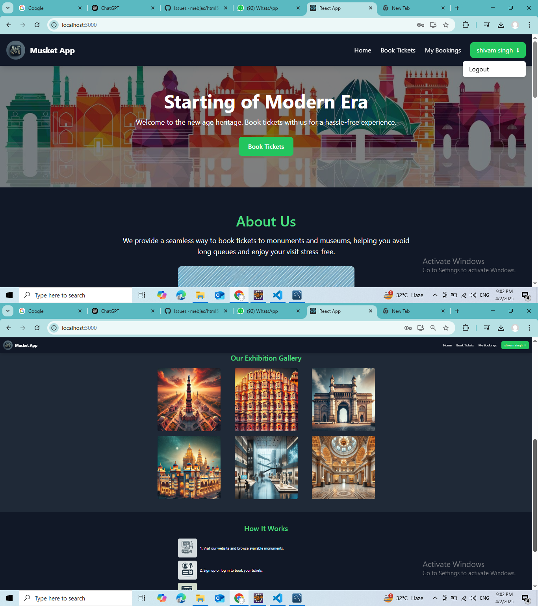
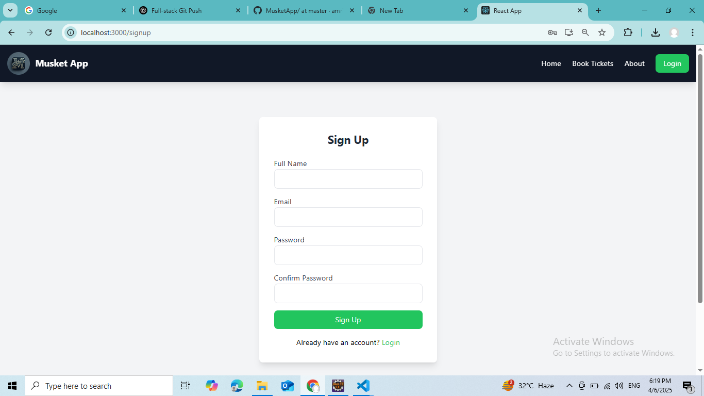
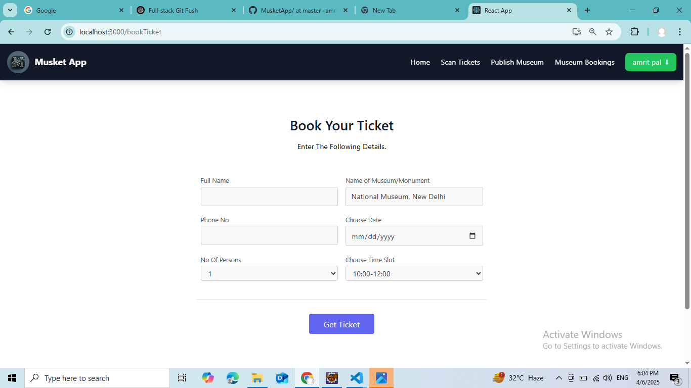
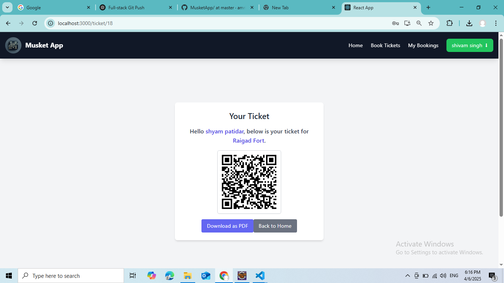
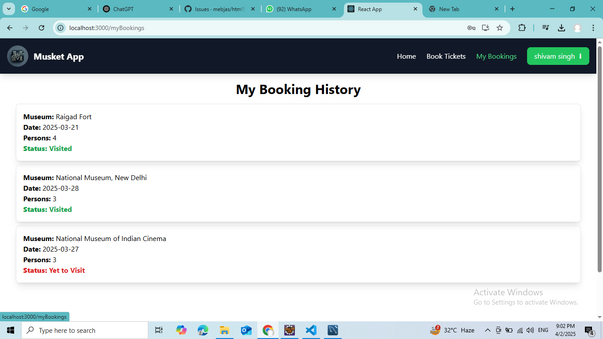
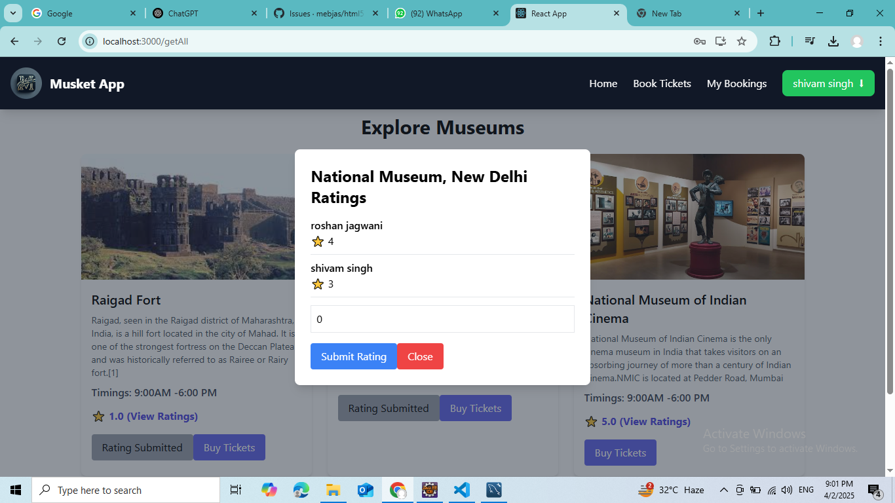
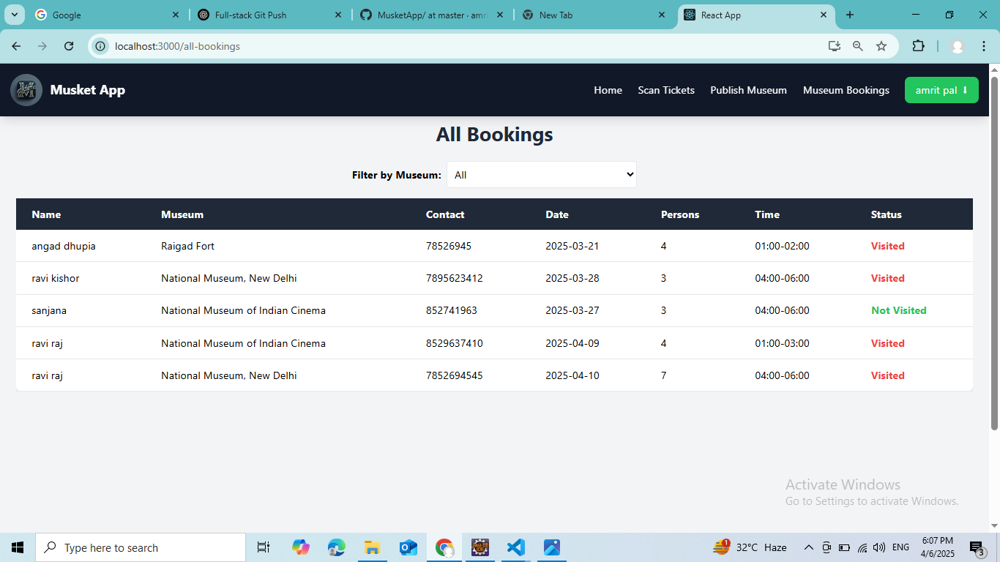
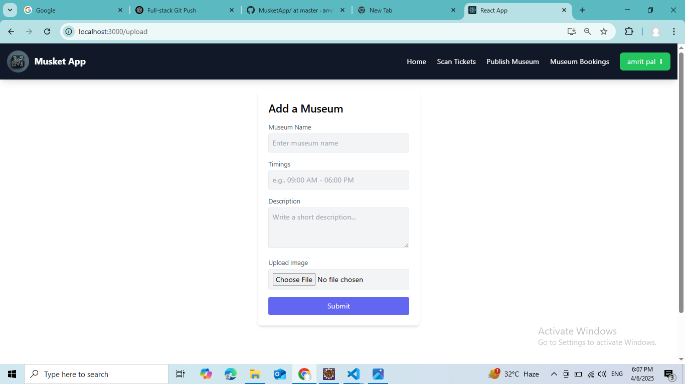
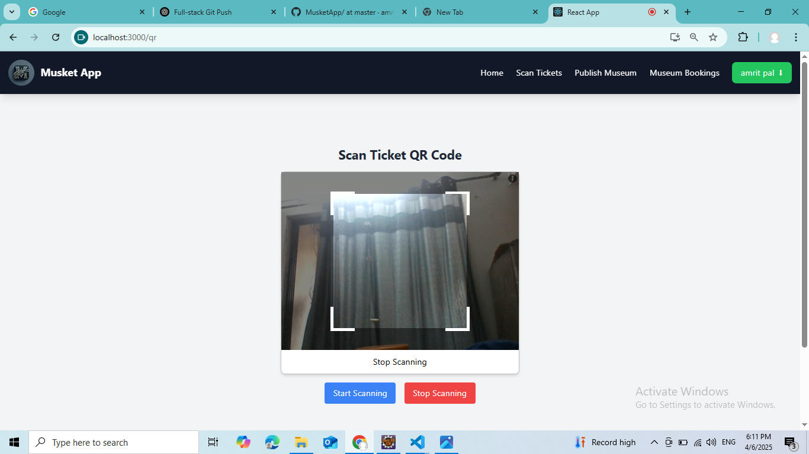

# 🏛️ Musket - Museum Booking Application

Musket is a full-stack museum booking platform that enables users to explore, book, and rate museums. It also includes a QR-based ticketing system and an admin panel for managing listings and validating tickets.

---

## 🚀 Features

### 👤 User Features

- **🔐 Registration & Email Verification**
  - Users register with their details.
  - A verification email is sent upon signup.
  - Email verification is mandatory before login.

- **🔑 Login & JWT Authentication**
  - Secure login with JSON Web Tokens (JWT).
  - Sessions are securely managed.

- **🏛️ Museum Booking**
  - Browse available museums.
  - Fill booking form with:
    - Name
    - Date & Time
    - Number of persons
  - View ratings before booking.

- **📜 Booking Management**
  - View all personal bookings.
  - Booking statuses: `Visited` or `Yet to Visit`.

- **📲 QR-Based Ticket Generation**
  - QR code is generated post-booking.
  - Must be scanned at the museum entrance.

- **⭐ Museum Rating**
  - Rate a museum after visiting.
  - "Rate Museum" is enabled only after visit.
  - One rating per user per museum.

---

### 🛠️ Admin Features

- **🏛️ Museum Management**
  - Admins can publish new museums.

- **🔍 QR Ticket Validation**
  - Scan and validate QR codes at entrances.
  - Mark tickets as used.

- **📊 Booking Monitoring**
  - View all user bookings.
  - Filter by museum or visit status.

---

## 🧰 Tech Stack

| Layer      | Technologies |
|------------|--------------|
| Frontend   | React.js, Redux, Tailwind CSS |
| Backend    | Spring Boot, Spring Security, JWT |
| Database   | MySQL |
| QR Codes   | ZXing Library |
| Email Service | Spring Mail |
| Deployment | Docker, AWS |

---

## 📸 Screenshots
### 📝 Home Page  

### 📝 Registration Page  

### 🏛️ Museum Listing  

### 🧾 Booking Form  

### 🎫 QR Code Ticket  

### 📋 User Booking History  

### ⭐ Museum Submit Rating  

### 🛠️ Admin Panel- View All Bookings  

### 🛠️ Admin Panel- Publish Museum  

### 📷 QR Code Scanner (Admin)  

---

## 🔮 Future Enhancements

- 💳 Integration with payment gateways for booking fees.
- 📊 Live museum availability status.
- 🌐 Multi-language support.
- 📈 Enhanced analytics for admin dashboards.

